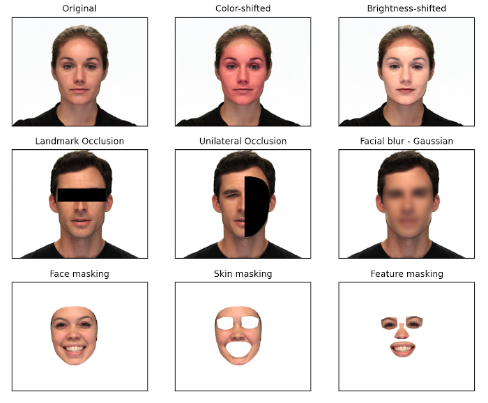

# PyFAME: the Python Facial Analysis and Manipulation Environment


PyFAME is a python package for dynamic region occlusion and skin colour modification of faces in video and images. Provides a range of tools for changing the colour of user-specified facial regions using industry-standard colour spaces (L*a*b, HSV, BGR), occlusion of user-defined facial regions (e.g., eyes, nose, mouth, hemi-face), and isolation of the head from background scene through video matting. Facial modifications can be further transitioned on and off through a range of timing functions (e.g., linear, sigmoid, Gaussian etc).

PyFAME enables researchers to apply complex facial manipulations to just the face in dynamic video and still images scenes in several lines of code.
Here is an example of PyFAME performing pixel-level modifications to create new videos from the original one:



## Statement of Need

Currently, there are no available tools for performing these types of pixel-level operations over videos. Existing research has commonly used general image editing tools (such as Photoshop). However, these tools apply changes to the entire image, causing noticeable background artifacts. PyFAME provides users the ability to selectively modify specific regions of the face, for both static images and videos. Our package also seamlessly integrates temporal functions into it's video processing, allowing users to specify how and when pixel-level operations will be applied.

## A Quick Example: 

```Python
import pyfame as pf

# pyfame.core functions are all exposed in the top-level import
pf.occlude_face_region(...)

# Extra utility functions like the parameter display functions are 
# available in pyfame.utils
pf.utils.display_all_landmark_paths()

# Specific commonly used utils submodules are exposed at the top level 
# This includes all predefined constants, landmarks and timing functions
pf.OCCLUSION_FILL_BAR
pf.HEMI_FACE_LEFT_PATH
pf.sigmoid()
```

## Underlying Model

MediaPipe's Face Mesh solution provides automated detection of 478 unique facial landmarks. By accessing the x-y pixel coordinates of these landmarks, many complex image and video manipulations can be performed. 
For more on mediapipe, see [here](https://ai.google.dev/edge/mediapipe/solutions/guide)

## Documentation and Changelog

This project maintains a changelog, following the format of [keep a changelog](https://keepachangelog.com/en/1.0.0/). This project also adheres to [semantic versioning](https://semver.org/spec/v2.0.0.html).

To view our documentation, examples and tutorials, see [PyFAME Docs](https://gavin-bosman.github.io/PyFAME/).

## Contributing

PyFAME is a young project, and it is still far from perfect! If you have any ideas on how to improve the package please submit an inquiry and we will work on implementing it right away!

Pull requests are always welcome. If you spot a mistake, error, or inefficiency within the source code, let us know!

## License

[GPLv3](https://www.gnu.org/licenses/gpl-3.0.en.html)